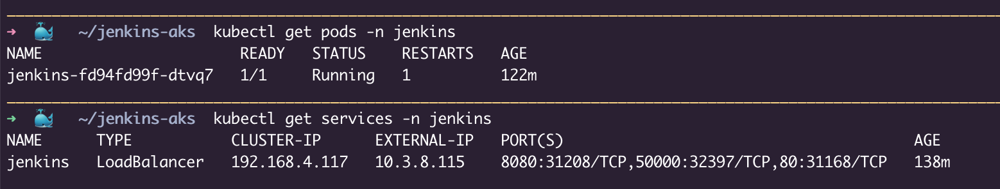

# AKS_Jenkins_Deployment
This repository contains Kubernetes manifests and scripts to deploy Jenkins on Azure Kubernetes Service (AKS). The deployment uses a PersistentVolume and PersistentVolumeClaim for data persistence, a Deployment manifest to run Jenkins, and a LoadBalancer Service to expose Jenkins externally. This setup is designed for scalable, automated CI/CD pipelines using Jenkins in a cloud-native environment.

### Running the Kubernetes Files
Note: Jenkins resources are deployed in the jenkins namespace.
```
#Deploy Jenkins Master Pod
kubectl apply -f <folder_name> -n jenkins

#Validate Pod and Service Status
kubectl get pods -n jenkins
kubectl get services -n jenkins
```


### Retrieve Jenkins Administrative Password
Check the logs of the Jenkins Pod to find the initial admin password:
```
kubectl logs <pod_name> -n jenkins
```

Set default username and password to login inside jenkins. 

### Login to Jenkins
Use the default username and the retrieved password to log in.
If you encounter the "No valid crumb" error when creating a new job, fix it by enabling proxy compatibility:
- Go to Manage Jenkins → Configure Global Security → CSRF Protection
- Check Enable proxy compatibility


### Components and Flow
1. Persistent Storage
 - PersistentVolume (PV): Defines a 4Gi local storage volume on the AKS node at /data.
 - PersistentVolumeClaim (PVC): Claims 4Gi from the PV to ensure Jenkins data persists across Pod restarts.

This storage setup ensures Jenkins configuration, jobs, and data are preserved even if the Pod restarts or migrates.

2. Jenkins Deployment
 - Runs a single Jenkins Pod using the official jenkins Docker image.
 - Configured with JVM options to allocate 2GB heap and optimize slave provisioning.
 - Uses the persistent storage volume mounted at /var/jenkins_home.
 - Runs with runAsUser: 0 (root) — you may want to adjust this for production security.
 - Uses an image pull secret (etotestcredentials) to authenticate with private Docker registries if needed.

3. Jenkins Service
 - Exposes Jenkins on port 8080 for the UI and 50000 for agent communication.
 - The service type is LoadBalancer, provisioning an external cloud load balancer.
 - Port 80 is forwarded to 8080 for convenient HTTP access.

### Setup Instructions
1. Clone this repository
```
git clone https://github.com/Takshika/AKS_Jenkins_Deployment.git
cd AKS_Jenkins_Deployment
```
2. Apply Persistent Volume and Claim
```
kubectl apply -f persistent-volume.yaml -n jenkins
kubectl apply -f persistent-volume-claim.yaml -n jenkins
```
3. Deploy Jenkins
```
kubectl apply -f jenkins-deployment.yaml -n jenkins
```
4. Expose Jenkins Service
```
kubectl apply -f jenkins-service.yaml -n jenkins
```
5. Verify Pods Status
```
kubectl get pods -n jenkins         # Check Pods status
kubectl get svc jenkins -n jenkins  # Get external IP assigned to Jenkins service
```
6. Access Jenkins
 - Open the external IP in your browser on port 8080 or 80.
 - Retrieve the initial admin password (see above).

### Important Notes
- Security: Running Jenkins as root (runAsUser: 0) is simple but not recommended for production. Consider using a less privileged user.
- Storage: The current PersistentVolume uses hostPath, which ties storage to a single node. For production, use a network-backed storage class like Azure Disk or Azure Files for high availability.
- Image Pull Secrets: Update testcredentials to your actual Kubernetes secret name if you use private Docker images.

### Why Use This?
 - Easily deploy Jenkins CI/CD on AKS with persistent data storage.
 - Automate infrastructure provisioning using Kubernetes manifests.
 - Gain scalability and reliability via Kubernetes orchestration.
 - Expose Jenkins externally with a managed Azure Load Balancer.

### Future Improvements
 - Use Helm charts for templated and reusable deployment configurations.
 - Add ingress with TLS for secure Jenkins access.
 - Automate Jenkins pipeline creation and configuration via scripts or Jenkins Configuration as Code.
 - Harden security contexts and restrict permissions.

