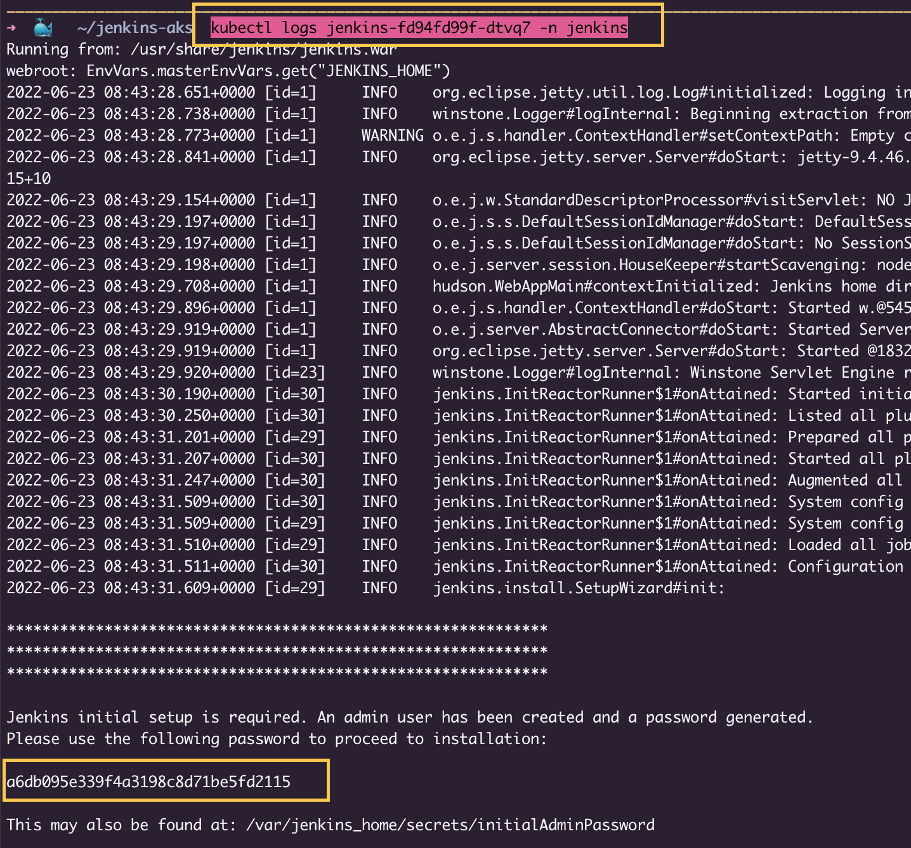

# AKS_Jenkins_Deployment
## Running the kubernetes file
To run jenkins master pod
```
kubectl apply -f<folder_name> -n jenkins
```
To validate if the pod is up or not
```
Kubectl get pods
kubectl get services
```


To get the administrative password for jenkins pods, check pod logs
```
kubectl logs <pod_name> 
```
Set default username and password to login inside jenkins. 

Try creating new job, if it lands you to "No valid crumb" error as below, go to manage jenkins→ Configure Global security→CSRF Protection and select enable proxy compatibility.
